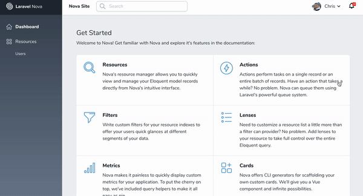

# Nova Notification Feed

[](https://packagist.org/packages/coreproc/nova-notification-feed)
[](https://scrutinizer-ci.com/g/coreproc/nova-notification-feed)
[](https://packagist.org/packages/coreproc/nova-notification-feed)

A Laravel Nova package that adds a notification feed in your Nova app and uses Laravel Echo and websockets to receive and broadcast notifications.



## Installation

You can install the package into a Laravel app that uses [Nova](https://nova.laravel.com) via composer:

```bash
composer require coreproc/nova-notification-feed
```

This package makes use of Laravel's database notification feature and [Nova Echo](https://github.com/CoreProc/nova-echo) to receive and broadcast notifications.

By using [Nova Echo](https://github.com/CoreProc/nova-echo), we have a readily configured Laravel Echo instance in our JS.

Here are the suggested options for broadcasting/receiving using websockets:
- [Pusher](https://pusher.com)
- [Laravel Websockets](https://docs.beyondco.de/laravel-websockets/)
- [Laravel Echo Server](https://github.com/tlaverdure/laravel-echo-server)

Make sure that you already have any of these options set up and prepare your Laravel project to use it for broadcasting notifications.

You can find instructions about broadcasting in Laravel using the [official documentation](https://laravel.com/docs/5.7/broadcasting).

Follow the docs, make sure to run the following to get the `notifications` table if you have not done so already:

```
php artisan notifications:table

php artisan migrate
```

Before broadcasting any events, you will first need to register the `App\Providers\BroadcastServiceProvider`. In fresh Laravel applications, you only need to uncomment this provider in the `providers` array of your `config/app.php` configuration file. This provider will allow you to register the broadcast authorization routes and callbacks.

Make sure that you configure the correct environment variables in your `.env` file:

```
BROADCAST_DRIVER=pusher

PUSHER_APP_ID=xxxxxxx
PUSHER_APP_KEY=xxxxxxx
PUSHER_APP_SECRET=xxxxxx
PUSHER_APP_CLUSTER=xxx
```

You will also need to ensure that you have added an authorization broadcast route in `routes/channels.php`:

```php
Broadcast::channel('App.User.{id}', function ($user, $id) {
    return (int)$user->id === (int)$id;
});
```

Receiving notifications will depend on your `User` model having the `Notifiable` trait. You can add the `receivesBroadcastNotificationsOn` to use a different channel name instead of the user model's namespace.

```php
class User extends Authenticatable
{
    use Notifiable;

    ...

    /**
     * The channels the user receives notification broadcasts on.
     *
     * @return string
     */
    public function receivesBroadcastNotificationsOn()
    {
        return 'users.' . $this->id;
    }
}
```

Finally, once you have ensured that this is set up, you will also need to override Nova's `layout.blade.php`. Create a layout file in `resources/views/vendor/nova/layout.blade.php` and copy the contents from `vendor/laravel/nova/resources/views/layout.blade.php`.

Add these two lines to the layout template:

```
// file: resources/views/vendor/nova/layout.blade.php

<!DOCTYPE html>
<html lang="en" class="h-full font-sans antialiased">
<head>
  <meta charset="utf-8">
  <meta name="viewport" content="width=1280">
  <meta name="csrf-token" content="{{ csrf_token() }}">

  @include('nova-echo::meta') <!-- INCLUDE THIS LINE HERE -->

  <title>

  ...

  <dropdown class="ml-auto h-9 flex items-center dropdown-right">
    @include('nova::partials.user')
  </dropdown>

  @include('nova_notification_feed::notification_feed') <!-- AND THIS LINE HERE -->

  ...
```

You should now be able to see the notification bell on the top right of your Nova UI.

## Usage

To broadcast notifications to your notification feed in the Nova app, you can make a notification class that sends notifications via `database` and `broadcast`. Here is an example notification class:

```php
use Coreproc\NovaNotificationFeed\Notifications\NovaBroadcastMessage;
use Illuminate\Bus\Queueable;
use Illuminate\Notifications\Messages\BroadcastMessage;
use Illuminate\Notifications\Notification;

class TestNotification extends Notification
{
    use Queueable;

    protected $level = 'info';
    protected $message = '';

    /**
     * Create a new notification instance.
     *
     * @param $level
     * @param $message
     */
    public function __construct($level, $message = 'Test message')
    {
        $this->level = $level;
        $this->message = $message;
    }

    /**
     * Get the notification's delivery channels.
     *
     * @param  mixed $notifiable
     * @return array
     */
    public function via($notifiable)
    {
        return [
            'database',
            'broadcast',
        ];
    }

    /**
     * Get the array representation of the notification.
     *
     * @param  mixed $notifiable
     * @return array
     */
    public function toArray($notifiable)
    {
        return [
            'level' => $this->level,
            'message' => $this->message,
            'url' => 'https://coreproc.com',
            'target' => '_self'
        ];
    }

    /**
     * Get the broadcastable representation of the notification.
     *
     * @param  mixed $notifiable
     * @return BroadcastMessage
     */
    public function toBroadcast($notifiable)
    {
        return new NovaBroadcastMessage($this->toArray($notifiable));
    }
}
```

Nova Notification Feed relies on having three variables passed in the `toArray()` method of the notification class: `level`, `message`, and `url`, and an optional `target` (default: `'_blank'`).

Additionally, you can use the `NovaBroadcastMessage` class in the `toBroadcast()` method to ensure that the format of the broadcast can be read by the frontend.

## Roadmap

- Differentiate background color of a new notification
- Check if the URL is an JSON representation of a route `{ name: 'index', params: {} }`
- Better design?

## Changelog

Please see [CHANGELOG](CHANGELOG.md) for more information on what has changed recently.

## Contributing

Please see [CONTRIBUTING](CONTRIBUTING.md) for details.

## Security

If you discover any security-related issues, please email chris.bautista@coreproc.ph instead of using the issue tracker.

## Credits

- [Chris Bautista](https://github.com/chrisbjr)

## About CoreProc

CoreProc is a software development company that provides software development services to startups, digital/ad agencies, and enterprises.

Learn more about us on our [website](https://coreproc.com).

## License

The MIT License (MIT). Please see [License File](LICENSE.md) for more information.
